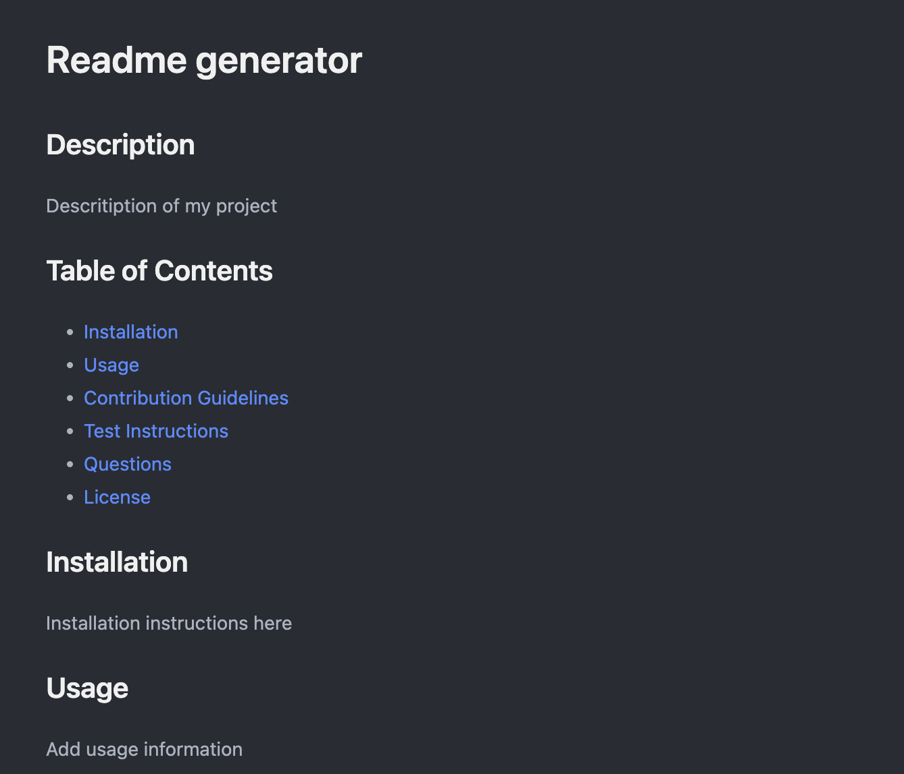

# README.md Generator

## Description
This tool allows you to easily generate a README file directly from your terminal.

## Table of Contents

- [Installation](#installation)
- [Usage](#usage)
- [Contribution Guidelines](#contribution-guidelines)
- [Test Instructions](#test-instructions)
- [Questions](#questions)
- [License](#license)

## Installation
1. Install Node. Ensure inquirer and fs are installed. 3. Run node index.js

## Usage

## Screenshot

### Screenshot

## Contribution Guidelines
https://www.contributor-covenant.org/

## Test Instructions
NA

## Questions
https://github.com/maaront
matthewturnera@gmail.com

## License
MIT
